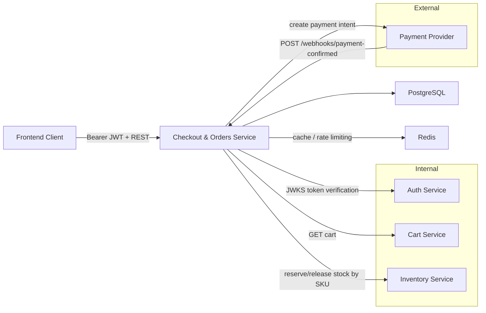

# Checkout & Orders Service — Microservice Design Document
**Service Name:** checkout-orders-service  
**API Version:** 1.1.0  
**Base Path:** `/v1`

**Last Updated:** 2026-02-05


## Overview

The **Checkout & Orders Service** is responsible for converting an authenticated user’s cart into an order-ready checkout session, managing the order lifecycle, and processing payment confirmation events delivered via webhook. It guarantees idempotent webhook processing and prevents overselling by reserving inventory at checkout creation time.

This service exposes:
- **Checkout**: create a checkout session from the current cart (`POST /checkout`)
- **Orders**: list and read a user’s orders (`GET /orders`, `GET /orders/{orderId}`)
- **Webhooks**: confirm payment and transition orders to `paid` (`POST /webhooks/payment-confirmed`)


## API Surface

### Endpoints

| Endpoint | Auth | Responsibility |
|---|---:|---|
| `POST /checkout` | Bearer JWT | Validate cart and create checkout session with payment client secret |
| `GET /orders` | Bearer JWT | Return paginated list of current user’s orders |
| `GET /orders/{orderId}` | Bearer JWT | Return order details (ownership enforced) |
| `POST /webhooks/payment-confirmed` | (signature header) | Verify signature, idempotently mark order as paid |

### Authentication
- Protected endpoints use **HTTP Bearer JWT** (`Authorization: Bearer <token>`).
- Webhook endpoint is authenticated via **HMAC signature** in `X-Webhook-Signature`.

### Errors
All errors use:
```json
{
  "code": "bad_request",
  "message": "Validation failed",
  "details": [
    { "field": "items[0].sku", "issue": "must not be empty" }
  ]
}
````


## Dependencies

### Service-to-Service Dependencies

| Dependency        | Contract                                   | Purpose                                         |
| ----------------- | ------------------------------------------ | ----------------------------------------------- |
| Auth Service      | JWKS endpoint                              | JWT verification (issuer keys)                  |
| Cart Service      | `GET /cart`                                | Load current user cart and items                |
| Inventory Service | Reserve/release operations by SKU          | Validate availability and reserve stock         |
| Payment Provider  | Payment intent creation + webhook delivery | Create payment intent and receive confirmations |

### Infrastructure Dependencies

* **PostgreSQL**: orders, checkout sessions, idempotency keys
* **Redis**: caching and rate limiting (optional but supported)
* **Observability**: metrics + tracing exporters

### Application Dependencies (Java / Spring Boot)

* Spring Boot Web (REST)
* Spring Security (JWT)
* Bean Validation
* Spring Data JPA
* PostgreSQL driver
* Flyway (migrations)
* Micrometer + OpenTelemetry (metrics/tracing)
* Testcontainers + WireMock (testing)


## Architecture

### System Context Diagram




## Domain Model

### Aggregates

#### Order

Represents a purchase and its lifecycle.

* **ID:** `ord_*`
* **Statuses:** `pending`, `paid`, `shipped`, `delivered`, `cancelled`, `refunded`
* **Contains:** items, totals, shipping address, payment metadata

Schema alignment:

* `Order { id, status, createdAt, items[], totals{subtotal, shipping, total}, shippingAddress }`

#### CheckoutSession

Represents a checkout step created from a cart, including payment client secret.

* **ID:** `chk_*`
* **Statuses:** `created`, `confirmed`, `failed`
* **Contains:** order preview, payment provider info

Schema alignment:

* `CheckoutSession { id, status, orderPreview, payment{provider, clientSecret} }`

### Value Objects

* `Money { amount, currency }`
* `Address { fullName, line1, line2?, city, state?, country, postalCode, phone? }`


## Persistence Model

### Tables

#### `orders`

| Column                | Type       | Notes                   |
| --------------------- | ---------- | ----------------------- |
| id                    | varchar PK | `ord_*`                 |
| user_id               | varchar    | JWT subject             |
| status                | varchar    | `pending/paid/...`      |
| created_at            | timestamp  |                         |
| updated_at            | timestamp  |                         |
| currency              | varchar    | e.g., `EUR`             |
| subtotal_amount       | decimal    |                         |
| shipping_amount       | decimal    |                         |
| total_amount          | decimal    |                         |
| items_json            | jsonb      | serialized `CartItem[]` |
| shipping_address_json | jsonb      | serialized `Address`    |
| payment_provider      | varchar    | e.g., `stripe`          |
| payment_id            | varchar    | e.g., `pi_123`          |

#### `checkout_sessions`

| Column             | Type       | Notes                      |
| ------------------ | ---------- | -------------------------- |
| id                 | varchar PK | `chk_*`                    |
| user_id            | varchar    |                            |
| status             | varchar    | `created/confirmed/failed` |
| order_preview_json | jsonb      | serialized `OrderPreview`  |
| provider           | varchar    |                            |
| client_secret      | varchar    |                            |
| created_at         | timestamp  |                            |
| updated_at         | timestamp  |                            |

#### `idempotency_keys`

| Column       | Type       | Notes                 |
| ------------ | ---------- | --------------------- |
| key          | varchar PK | webhook `event.id`    |
| processed_at | timestamp  |                       |
| result_ref   | varchar    | order id / transition |


## Core Flows

### Create Checkout Session — `POST /checkout`

**Input:** `CheckoutRequest { shippingAddress, paymentMethod }`
**Output:** `201 CheckoutSession`

**Processing steps**

1. Authenticate user via JWT.
2. Load current cart from Cart Service.
3. Validate cart is not empty and item quantities are valid.
4. Reserve stock per item SKU through Inventory Service.
5. Calculate `subtotal`, `shipping`, `total` using `Money`.
6. Create payment intent and obtain `clientSecret`.
7. Create checkout session (`status=created`) and persist.
8. Create a corresponding order record (`status=pending`) and persist.
9. Return `CheckoutSession` payload.

**Conflicts**

* If any SKU cannot be reserved → return `409` with `Error`.

### List Orders — `GET /orders`

1. Authenticate user.
2. Query orders by `user_id` with pagination.
3. Return `OrderListResponse`.

### Get Order Details — `GET /orders/{orderId}`

1. Authenticate user.
2. Load order by `orderId`.
3. Enforce ownership (`order.user_id == jwt.sub`).
4. Return `Order`.

### Payment Confirmed Webhook — `POST /webhooks/payment-confirmed`

**Input:** `PaymentConfirmedEvent` + `X-Webhook-Signature` header
**Output:** `204 No Content`

**Processing steps**

1. Verify HMAC signature over the raw request body.
2. Enforce idempotency using `event.id`:

   * If already processed → return `204`.
3. Load order by `event.data.orderId`.
4. Validate payment amount/currency matches `order.total`.
5. Transition order status to `paid`.
6. Persist `payment_provider` and `payment_id`.
7. Record idempotency key.
8. Return `204`.


## Business Rules

### Stock Reservation

* Stock is reserved at checkout session creation to prevent overselling.
* Reservation is time-bound; on expiry, inventory is released.

### Amount Verification on Webhook

* Webhook `amount` must match order `total` (amount + currency).
* Mismatch is rejected with `400` and logged with correlation identifiers.

### Ownership & Access

* A user can list and read only their own orders.
* Webhook endpoint bypasses JWT and relies on signature verification.


## Reliability & Consistency

### Idempotency

* Webhook deliveries are at-least-once.
* Idempotency is guaranteed by `idempotency_keys` keyed by `event.id`.

### Transaction Boundaries

* Order state transition to `paid` is performed in a DB transaction that also writes the idempotency record.

### Failure Modes

* If inventory reservation succeeds but payment intent creation fails:

  * Checkout session is marked `failed`.
  * Inventory reservation is released immediately.
* If webhook arrives before the order exists:

  * Request is rejected with `400` and logged for reconciliation.


## Security

* JWT verification for all customer-facing endpoints.
* HMAC signature verification for webhook endpoint.
* Secrets stored outside source control; injected via environment variables.
* Sensitive fields are masked in logs (`clientSecret`, payment keys, full addresses).


## Observability

### Logging

Structured logs include:

* `traceId`, `correlationId`
* `userId`, `orderId`, `checkoutSessionId`
* webhook `eventId`, `paymentId`
* state transitions

### Metrics

* `checkout_sessions_created_total`
* `checkout_stock_conflicts_total`
* `orders_paid_total`
* `webhook_invalid_signature_total`
* latency histograms for `/checkout` and webhook handler

### Tracing

Distributed tracing spans:

* CartClient calls
* InventoryClient calls
* PaymentClient calls
* DB transactions

## Local Development Environment Setup

### Prerequisites
Install and verify:
- Docker + Docker Compose
- JDK 21
- Maven

Quick checks:
```bash
docker --version
docker compose version
java -version
mvn -version
````

### Configure Environment Variables

1. Copy env template:

```bash
cp .env.example .env
```

2. Open `.env` and set values for:

* `PORT`
* `DB_*`
* `AUTH_JWKS_URL`
* `CART_BASE_URL`
* `INVENTORY_BASE_URL`
* `PAYMENT_API_KEY`
* `PAYMENT_WEBHOOK_SECRET`
* `REDIS_*` (if enabled)

3. Export env vars in the current shell session:

**macOS/Linux**

```bash
export $(cat .env | xargs)
```

**Windows PowerShell**

```powershell
Get-Content .env | ForEach-Object {
  if ($_ -match "^\s*#") { return }
  if ($_ -match "^\s*$") { return }
  $pair = $_.Split("=",2)
  [System.Environment]::SetEnvironmentVariable($pair[0], $pair[1])
}
```

### Start Local Dependencies (Postgres, Redis, etc.)

From the repo root:

```bash
docker compose up -d
docker compose ps
```

Confirm Postgres is reachable:

```bash
docker logs checkout_postgres --tail=50
```

(Optional) If the repo includes a Makefile:

```bash
make infra-up
```

### Initialize Database Schema (Migrations)

Run migrations using the project’s configured tool.

**Flyway**

```bash
./mvnw -DskipTests flyway:migrate
```

**Liquibase**

```bash
./mvnw -DskipTests liquibase:update
```

If migrations are configured to run automatically on startup, this step can be skipped.

### Run the Service

#### Maven

```bash
./mvnw spring-boot:run
```

#### Gradle

```bash
./gradlew bootRun
```

If your repo provides a script:

```bash
./scripts/run-local.sh
```

### Verify Service Health

If Actuator is enabled:

```bash
curl -s "http://localhost:${PORT}/actuator/health"
```

If Actuator is not enabled, verify by hitting an authenticated endpoint after obtaining a JWT (see next section).

### Run/Point to Required Upstream Services

The service requires reachable URLs for:

* Auth JWKS (`AUTH_JWKS_URL`)
* Cart service (`CART_BASE_URL`)
* Inventory service (`INVENTORY_BASE_URL`)

Ensure each is available locally by either:

* starting them with Docker Compose (if included), or
* running them via their own local run commands, or
* pointing to a shared dev environment.

Quick connectivity checks:

```bash
curl -i "$AUTH_JWKS_URL"
curl -i "$CART_BASE_URL/health"       # if available
curl -i "$INVENTORY_BASE_URL/health"  # if available
```

### Smoke Test the API

#### 1) Create checkout session

```bash
curl -i -X POST "http://localhost:${PORT}/checkout" \
  -H "Authorization: Bearer <JWT>" \
  -H "Content-Type: application/json" \
  -d '{
    "shippingAddress": {
      "fullName": "John Doe",
      "line1": "Street 10",
      "line2": "Apt 2B",
      "city": "Rome",
      "state": "RM",
      "country": "IT",
      "postalCode": "00100",
      "phone": "+39 543 857 344"
    },
    "paymentMethod": "pm_card_visa"
  }'
```

#### 2) List orders

```bash
curl -s "http://localhost:${PORT}/orders?page=1&limit=20" \
  -H "Authorization: Bearer <JWT>"
```

#### 3) Send payment confirmed webhook

> Signature must be computed according to the webhook verifier implementation using `PAYMENT_WEBHOOK_SECRET`.

```bash
curl -i -X POST "http://localhost:${PORT}/webhooks/payment-confirmed" \
  -H "Content-Type: application/json" \
  -H "X-Webhook-Signature: <computed-signature>" \
  -d '{
    "id": "evt_123",
    "type": "payment.confirmed",
    "createdAt": "2026-02-04T10:20:00Z",
    "data": {
      "provider": "stripe",
      "paymentId": "pi_123",
      "orderId": "ord_9001",
      "amount": { "amount": 138.99, "currency": "EUR" }
    }
  }'
```

### Shut Down / Clean Up

Stop containers:

```bash
docker compose down
```

Stop and remove volumes (resets DB):

```bash
docker compose down -v
```

## Common Setup Issues

* **Port already in use**

  * Change `PORT` in `.env` and restart.
* **DB connection refused**

  * Ensure `docker compose ps` shows Postgres as `running`.
  * Confirm `DB_HOST=localhost`, `DB_PORT=5432`.
* **401 Unauthorized on `/checkout` or `/orders`**

  * JWT invalid or JWKS not reachable; verify `AUTH_JWKS_URL`.
* **409 Conflict on `/checkout`**

  * Inventory reservation failed; verify Inventory service is reachable and has stock.
* **Webhook returns 401**

  * Signature mismatch; confirm the secret and the exact signing algorithm (raw body HMAC).

## Verification Checklist (Local)

### Checkout

```bash
curl -i -X POST "http://localhost:8084/checkout" \
  -H "Authorization: Bearer <JWT>" \
  -H "Content-Type: application/json" \
  -d '{
    "shippingAddress": {
      "fullName": "John Doe",
      "line1": "Street 10",
      "line2": "Apt 2B",
      "city": "Rome",
      "state": "RM",
      "country": "IT",
      "postalCode": "00100",
      "phone": "+39 543 857 344"
    },
    "paymentMethod": "pm_card_visa"
  }'
```

### Orders

```bash
curl -s "http://localhost:8084/orders?page=1&limit=20" \
  -H "Authorization: Bearer <JWT>" | jq
```

### Webhook

```bash
curl -i -X POST "http://localhost:8084/webhooks/payment-confirmed" \
  -H "Content-Type: application/json" \
  -H "X-Webhook-Signature: <computed-signature>" \
  -d '{
    "id": "evt_123",
    "type": "payment.confirmed",
    "createdAt": "2026-02-04T10:20:00Z",
    "data": {
      "provider": "stripe",
      "paymentId": "pi_123",
      "orderId": "ord_9001",
      "amount": { "amount": 138.99, "currency": "EUR" }
    }
  }'
```

## Appendix A — Endpoint Ownership Map

| Endpoint                             | Service Owner             |
| ------------------------------------ | ------------------------- |
| `/auth/login`                        | Auth Service              |
| `/products`, `/products/{productId}` | Catalog Service           |
| `/categories`, `/brands`             | Catalog Service           |
| `/cart`, `/cart/items/{sku}`         | Cart Service              |
| `/checkout`                          | Checkout & Orders Service |
| `/orders`, `/orders/{orderId}`       | Checkout & Orders Service |
| `/webhooks/payment-confirmed`        | Checkout & Orders Service |